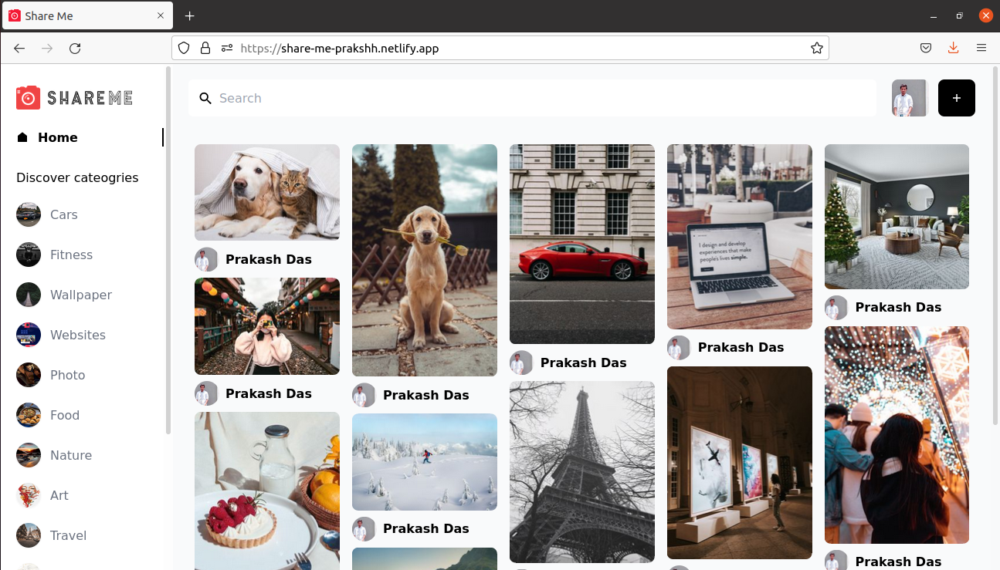

# ShareMe Social Media Application


## Introduction
This is a code repository of Image Sharing Full Stack Social Media Application using frontend with React and Tailwind & backend with Sanity.

## Built With

- React
- React Router Dom
- Tailwind
- Google Auth
- Sanity
- Deployed on Netlify

## Features :

- Masonry Image Effect.
- Users can add new images.
- Users can save the new images.
- Users can comment on each and every user post.
- User can delete their uploaded images.
- Usercan browse according to Image Categories.
- Users can search for the images.
- Users can download the images.
- User can open the uploaded images.
- User can open their saved images.

### 🛠 Installation and Setup Instructions

To get started just clone this repository. You will need `node.js`, `sanity` and `git` installed globally on your machine.

Run

```
npm install
```

```
npm start
```

Open [http://localhost:3000](http://localhost:3000) in your browser

### Show your support

📌 Please feel free to contribute to this project with your commits

Give a ⭐ if you like this website! You can fork it and contribute

# Can I contribute?

Sure, open an issue, point out errors, and what not? Wanna fix something yourselves? You're welcome to open a PR.

## Stay up to date with new projects
New major projects coming soon, keep checking stay up to date https://prakshh.github.io/